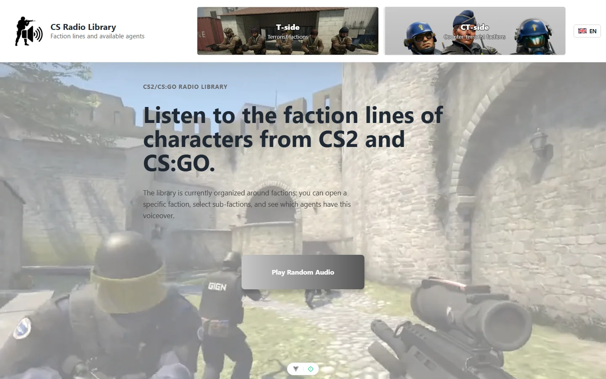
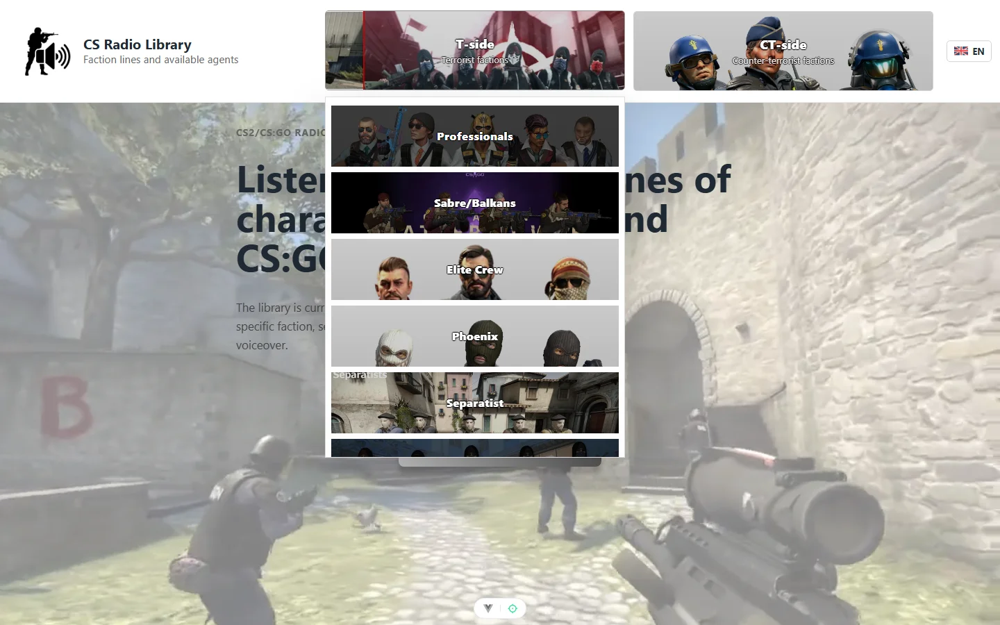
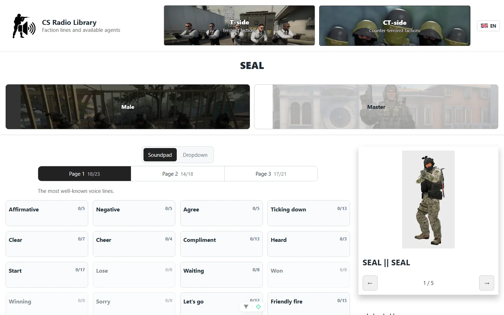
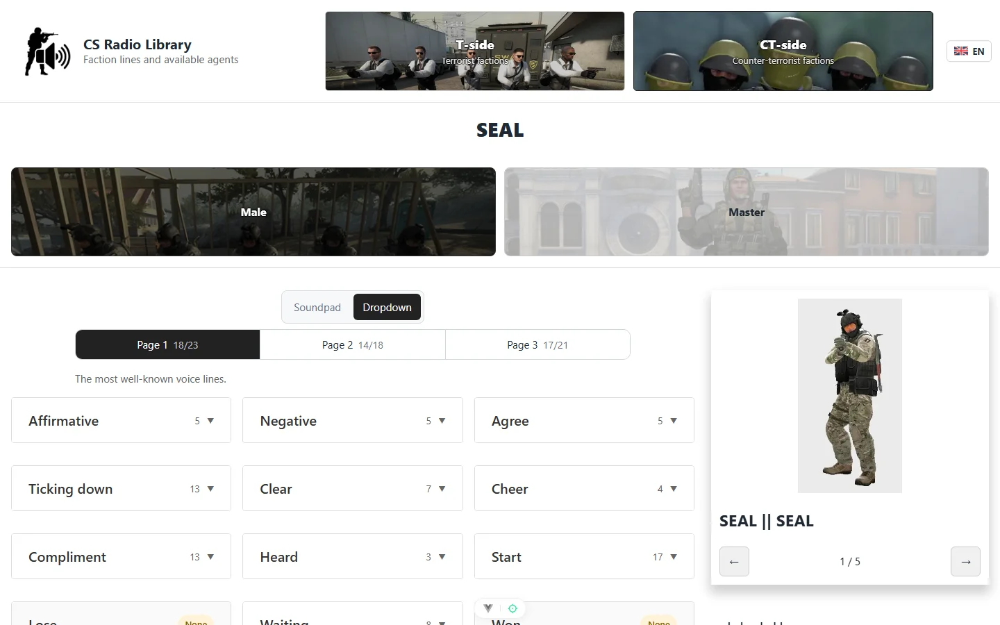

# CS Radio Library

A browser-based library of faction voice lines from **CS2** and **CS:GO** — pick a faction, switch between its sub-factions (male / female / master skins), and listen to every radio line, or let it play a random one for you. Each subfraction also shows the agent(s) that ship with that voice, so if you've ever heard a line in-game and wondered who's speaking, this is built to answer that.

Unofficial fan project — not affiliated with Valve.

## Screenshots

| Home | Browsing factions |
| --- | --- |
|  |  |

| Soundpad mode | Dropdown mode |
| --- | --- |
|  |  |

## What's here

- **Every CS2/CS:GO faction**, split into their sub-factions, with the agents available for each.
- Two ways to listen:
  - **Soundpad** — click a category, get a random unheard line each time, tracks how many you've heard.
  - **Dropdown** — expand a category to browse and replay a specific line.
  - Filter by voice-line category (Affirmative, Negative, Ticking down, Bomb-related, …), split across three pages by how commonly you'd hear them in a match.
- **English / Russian UI** — toggle in the header; nav, faction/subfraction labels, and page copy all switch live.
- Faction/subfraction preview thumbnails cycle through in-game screenshots automatically.
- A "Play Random Audio" button on the home page for when you just want to hear *something*.

## Tech stack

- [Vue 3](https://vuejs.org/) (Composition API, `<script setup>`) + TypeScript
- [Vite](https://vite.dev/) — dev server, build, and asset bundling (all audio/image assets are bundled from the frontend, no backend)
- [vue-router](https://router.vuejs.org/) for routing
- [Pinia](https://pinia.vuejs.org/) for the locale/i18n store
- Planned: [Capacitor](https://capacitorjs.com/) for an Android build

## Getting started

```bash
npm install
npm run dev          # start the dev server
npm run build        # type-check + production build
npm run preview      # preview the production build locally
```

Other useful scripts:

```bash
npm run test:unit    # Vitest
npm run test:e2e     # Playwright
npm run lint         # oxlint + eslint
npm run format       # prettier
```

## Project layout

Faction/agent data and their audio/image assets live under `src/interface/data/`; the resolution chain (faction → subfraction → voice pages → audio items) is lazy end-to-end via `import.meta.glob`, so only the audio file you actually click gets fetched. 

## Status

Actively evolving as a personal project — most factions and radio commands are in, a few lines are intentionally skipped where they weren't relevant. Contributions/issues aren't actively solicited since this is a solo pet project, but feel free to poke around.
